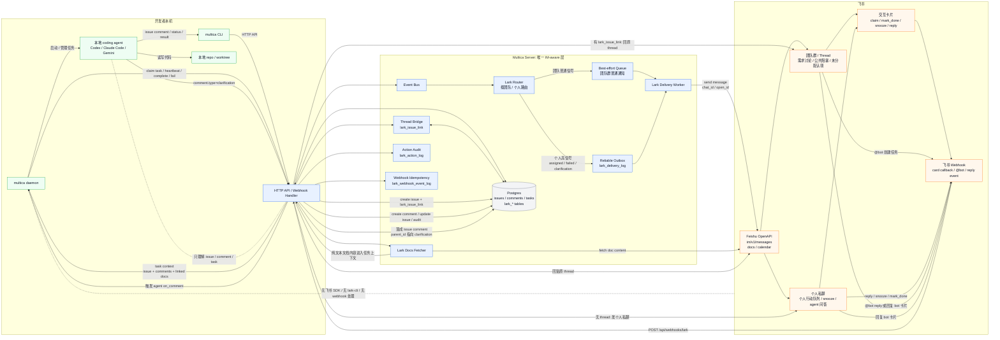

# Multica × 飞书集成设计方案

## 1. 背景与目标

multica 是一个轻量化的研发协同 control plane，本身只做任务编排与状态管理，把代码执行下沉到开发者本机的 daemon 与本地编程 agent（Claude Code、Codex 等）。本方案在不破坏这个 control plane 模型的前提下，把飞书引入到协同链路里。

**目标分两条通道：**
- **团队模式**：飞书群承载需求讨论、共识形成、公共阻塞和 thread → issue 闭环。
- **个人模式**：飞书私聊承载个人行动队列，类似"文件助手"里的 multica inbox。

**最终愿景**：项目管理（multica）、代码开发（cc / codex）、信息沟通（飞书）三者闭环联动，但团队群不被个人执行流淹没，所有 IM 复杂度只在 multica server 这一层处理。

## 2. 范围

**纳入范围：**
1. multica 事件 → 飞书团队群 / 个人私聊的分流通知（带可交互卡片）
2. 卡片按钮回写（claim / mark done / snooze / reply）
3. 任务上下文里的飞书文档自动展开
4. 同步会议创建（人触发）
5. 飞书 thread → multica issue（@bot 结构化动作）
6. 中途澄清问答桥（agent ↔ 飞书 thread 或个人私聊，经 server 中转）
7. multica web 端的飞书配置 UI
8. 个人飞书私聊通知偏好和测试消息

**显式排除：**
- 自由文本派活（"@bot 帮我修个登录 bug"这类 NLU）
- agent 主动对接飞书（绕过 server 的本地 CLI 调用）
- 飞书文档双向编辑（multica 状态自动回写文档表格）
- 会议纪要自动转任务
- daemon 侧的 lark-cli skill

## 3. 核心架构原则

> **multica server 是 IM-aware 层；daemon / agent runtime / coding CLI 对飞书完全无感知。**

这是整套设计的脊梁。守住这条原则，三个直接收益：

1. **agent 不需要学新协议** —— 它只看到任务描述、issue、comment 这些 multica 原生概念。
2. **daemon 不需要装 lark-cli 也不需要 Node.js** —— 部署面不变。
3. **未来换 IM（钉钉、Slack）只动 server 的一层文件** —— 集成与编排解耦。

### 三类角色分层

```
agent runtime（同级）：    codex, claude-code, gemini, ...
external system（同级）：  GitHub, Lark, Jira, ...
capability tool（同级）：  gh, lark-cli, jq, ...（当前 scope 不暴露）
```

飞书在架构里**与 GitHub 同级**（external system），与 codex / cc **不同级**。multica server 通过 Go 进程内 HTTP client 直接对接；API 表面扩大后可切到 [oapi-sdk-go](https://github.com/larksuite/oapi-sdk-go)。生产路径上不出现 lark-cli。

## 4. 需求清单

| 需求 | 用户角色 | 触发方 | 落地形式 |
|---|---|---|---|
| 群里讨论完直接转 issue | PM / Tech Lead | Lark → multica | thread 内 @bot 结构化动作 |
| 未分配任务在团队群可被认领 | 团队成员 | multica → Lark | 群卡片 `认领` |
| 已分配事项只通知相关个人 | assignee / watcher | multica → Lark | 个人私聊卡片 |
| 个人在飞书里处理自己的任务 | assignee | Lark → multica | 私聊卡片按钮 |
| 任务描述里贴 Lark 文档 URL，agent 自动看到内容 | 开发者 | multica 内部 | 派发前文档抓取 |
| 在 multica 一键给项目相关人建同步会议 | 项目负责人 | multica → Lark | 按钮 + 日历 API |
| agent 卡住要澄清，问题自动投到正确上下文 | 开发者 + agent | 双向 | thread / 私聊 comment 桥 |
| workspace 管理员绑定群、设置团队事件 | admin | UI | multica web settings |
| 每个用户一次性绑定自己的飞书账号和私聊偏好 | 用户 | UI | OAuth + preferences |

### 4.1 团队模式与个人模式

| 模式 | 设计目标 | 承载内容 | 禁止承载 |
|---|---|---|---|
| 团队模式 | 保留群作为需求讨论和团队共识场 | thread → issue、未分配任务、公共阻塞、会议同步、thread 内结果回贴 | 已分配给个人的常规状态变化 |
| 个人模式 | 把飞书私聊作为个人行动队列 | assigned、mention、agent 提问、task failed/done、snooze、个人摘要 | 团队讨论广播 |

路由原则：**团队群只放需要团队共同注意的信号；个人私聊放需要某个人行动的信号。**

| multica 事件 | 团队群 | 个人私聊 |
|---|---|---|
| `issue:created`，来源为 Lark thread | 回贴原 thread，附 issue 链接 | 通知 creator |
| `issue:created`，无 assignee | 可发群认领卡片 | 可选通知 owner/watchers |
| `issue:updated`，assignee 变化 | 默认不发群 | 通知新 assignee |
| `task:completed` | 仅 thread 来源回贴原 thread | 通知 assignee / creator |
| `task:failed` | 仅公共阻塞或 thread 来源发群 | 通知 assignee / creator |
| `comment:created`，@mention | 默认不发群 | 通知被 mention 人 |
| agent 澄清问题 | 有 `lark_issue_link` 时回原 thread | 无 thread 时通知 assignee / owner |
| 会议创建 | 回贴原 thread 或群 | 通知参会人 |

团队侧路由优先级：如果 issue 存在 `lark_issue_link`，所有团队侧消息只回贴原 thread，不再发到群顶部。群顶部认领卡只用于无 Lark thread 来源的未分配 issue。

## 5. 架构与文件结构

### 5.1 server 端新增/扩展

```
server/
├── internal/
│   ├── handler/
│   │   ├── github.go              (existing)
│   │   ├── lark.go                (new) — webhook 入口：事件订阅 + 卡片回调 + @bot
│   │   └── lark_settings.go       (new) — workspace 绑定 CRUD + 用户 OAuth / 偏好回调
│   └── service/
│       ├── email.go               (existing — 模板参考)
│       ├── lark_notify.go         (new) — 订阅 event bus，路由到群 / 私聊，调 Lark API
│       ├── lark_docs.go           (new) — 文档抓取
│       ├── lark_meeting.go        (new) — 日历事件创建
│       └── lark_thread.go         (new) — thread ↔ issue 桥接（comment 双向）
├── migrations/
│   └── NNNN_lark.sql              (new) — Lark 绑定、偏好、桥接、审计表（见 5.2）
└── pkg/protocol/
    └── events.go                  (extend) — Lark 相关事件常量
```

### 5.2 数据模型

```sql
-- workspace ↔ 团队群绑定。bot_token_enc 在 P1 为空，使用 app-level
-- tenant_access_token；后续需要群级 token 时再写入。
CREATE TABLE lark_workspace_binding (
    workspace_id      UUID PRIMARY KEY REFERENCES workspaces(id),
    chat_id           TEXT NOT NULL,
    bot_token_enc     BYTEA NOT NULL,
    enabled_events    TEXT[] NOT NULL DEFAULT '{}',
    created_at        TIMESTAMPTZ NOT NULL DEFAULT NOW(),
    updated_at        TIMESTAMPTZ NOT NULL DEFAULT NOW()
);

-- multica 用户 ↔ 飞书用户
CREATE TABLE lark_user_link (
    user_id           UUID PRIMARY KEY REFERENCES users(id),
    lark_open_id      TEXT NOT NULL UNIQUE,
    refresh_token_enc BYTEA,
    dm_enabled        BOOLEAN NOT NULL DEFAULT TRUE,
    linked_at         TIMESTAMPTZ NOT NULL DEFAULT NOW()
);

-- 用户通知偏好
CREATE TABLE lark_notification_pref (
    user_id           UUID NOT NULL REFERENCES users(id),
    workspace_id      UUID NOT NULL REFERENCES workspaces(id),
    event_kind        TEXT NOT NULL,
    channel           TEXT NOT NULL CHECK (channel IN ('dm', 'digest')),
    enabled           BOOLEAN NOT NULL DEFAULT TRUE,
    PRIMARY KEY (user_id, workspace_id, event_kind, channel)
);

-- issue ↔ thread（双向桥的关键状态）。同一个 thread 可拆出多个 issue。
CREATE TABLE lark_issue_link (
    id                UUID PRIMARY KEY,
    issue_id          UUID NOT NULL REFERENCES issues(id),
    chat_id           TEXT NOT NULL,
    root_message_id   TEXT NOT NULL,
    source_scope      TEXT NOT NULL DEFAULT 'thread',
    created_at        TIMESTAMPTZ NOT NULL DEFAULT NOW()
);
CREATE UNIQUE INDEX lark_issue_link_issue_id_idx
    ON lark_issue_link (issue_id);
CREATE UNIQUE INDEX lark_issue_link_unique_thread_issue_idx
    ON lark_issue_link (chat_id, root_message_id, issue_id);
CREATE INDEX lark_issue_link_thread_idx
    ON lark_issue_link (chat_id, root_message_id);

-- IM 写动作审计
CREATE TABLE lark_action_log (
    id                UUID PRIMARY KEY,
    workspace_id      UUID NOT NULL REFERENCES workspaces(id),
    user_id           UUID REFERENCES users(id),
    lark_open_id      TEXT,
    channel           TEXT NOT NULL CHECK (channel IN ('dm', 'team', 'thread')),
    verb              TEXT NOT NULL CHECK (verb IN (
        'claim', 'mark_done', 'snooze', 'reply', 'create_issue',
        'link_doc', 'open_meeting', 'retry', 'handoff'
    )),
    issue_id          UUID REFERENCES issues(id),
    message_id        TEXT,
    result            TEXT NOT NULL CHECK (result IN ('success', 'ignored', 'failed')),
    error             TEXT,
    created_at        TIMESTAMPTZ NOT NULL DEFAULT NOW()
);

-- webhook 幂等日志
CREATE TABLE lark_webhook_event_log (
    event_id          TEXT PRIMARY KEY,
    event_type        TEXT NOT NULL,
    message_id        TEXT,
    processed_at      TIMESTAMPTZ NOT NULL DEFAULT NOW()
);

-- 可靠投递 outbox（个人私聊高信号事件）
CREATE TABLE lark_delivery_log (
    id                UUID PRIMARY KEY,
    workspace_id      UUID NOT NULL REFERENCES workspaces(id),
    user_id           UUID REFERENCES users(id),
    channel           TEXT NOT NULL CHECK (channel IN ('dm', 'team', 'thread')),
    event_kind        TEXT NOT NULL,
    target_id         TEXT NOT NULL,
    payload_json      JSONB NOT NULL,
    status            TEXT NOT NULL DEFAULT 'pending',
    attempt           INT NOT NULL DEFAULT 0,
    next_attempt_at   TIMESTAMPTZ,
    last_error        TEXT,
    created_at        TIMESTAMPTZ NOT NULL DEFAULT NOW(),
    updated_at        TIMESTAMPTZ NOT NULL DEFAULT NOW()
);

-- 个人 snooze 状态。每条记录对应某个用户对某个 issue / reminder 的延后处理。
CREATE TABLE lark_snooze (
    id                UUID PRIMARY KEY,
    user_id           UUID NOT NULL REFERENCES users(id),
    workspace_id      UUID NOT NULL REFERENCES workspaces(id),
    issue_id          UUID REFERENCES issues(id),
    event_kind        TEXT NOT NULL,
    channel           TEXT NOT NULL DEFAULT 'dm' CHECK (channel = 'dm'),
    wake_at           TIMESTAMPTZ NOT NULL,
    status            TEXT NOT NULL DEFAULT 'pending'
        CHECK (status IN ('pending', 'sent', 'cancelled')),
    created_at        TIMESTAMPTZ NOT NULL DEFAULT NOW(),
    updated_at        TIMESTAMPTZ NOT NULL DEFAULT NOW()
);
CREATE INDEX lark_snooze_due_idx
    ON lark_snooze (wake_at)
    WHERE status = 'pending';

-- P6 需要扩展 comment.type，避免用文本启发式识别 agent 提问。
ALTER TABLE comment DROP CONSTRAINT comment_type_check;
ALTER TABLE comment ADD CONSTRAINT comment_type_check
    CHECK (type IN ('comment', 'clarification', 'status_change', 'progress_update', 'system'));
```

`lark_action_log` 不延期。所有来自飞书卡片或 @bot 的写动作都跨系统，必须可审计。

### 5.3 配置

| 项 | 位置 | 说明 |
|---|---|---|
| `LARK_APP_ID` | env | 应用凭证 |
| `LARK_APP_SECRET` | env | 应用凭证 |
| `LARK_VERIFICATION_TOKEN` | env | webhook 签名校验 |
| `LARK_ENCRYPT_KEY` | env | 加密订阅消息 |
| workspace 绑定 | DB + UI | admin 配置 |
| 用户绑定 | DB + UI | 用户一次性 OAuth，保存 open_id 供私聊投递 |
| 个人偏好 | DB + UI | 控制个人私聊事件 |

凭证一律走 env：自托管场景顺、泄露面小、不必专做加密存储逻辑。多租户 SaaS 化时再考虑提升为 UI。

## 6. 模块详细设计

### 6.1 出站通知 — `service/lark_notify.go`

订阅现有 event bus 后做路由判定，再渲染不同形态的卡片。出站通知按协作语义分流到团队群、原 thread 或个人私聊，禁止采用"事件默认进群"。

团队群卡片：

| 事件 | 投递条件 | 卡片内容 | 含按钮 |
|---|---|---|---|
| `EventIssueCreated` | 无 assignee，或来源为 Lark thread | 标题 + 描述摘要 + 创建人 | `认领` `查看` |
| `EventTaskFailed` | 公共阻塞，或 issue 来源为 Lark thread | 任务 + 错误摘要 | `查看` `转人工` |
| `EventIssueCommented` | mention 多人 / 团队，或需要公共决策 | comment 摘要 | `查看` |
| meeting created | 人触发，且有团队上下文 | 会议时间 + issue 链接 | `打开会议` |

个人私聊卡片：

| 事件 | 接收人 | 卡片内容 | 含按钮 |
|---|---|---|---|
| `EventIssueUpdated` assignee changed | 新 assignee | 任务 + 来源 + due date | `查看` `标完成` `稍后提醒` |
| `EventTaskCompleted` | assignee / creator | 任务 + PR / 结果链接 | `查看` |
| `EventTaskFailed` | assignee / creator | 错误摘要 + issue 链接 | `重试` `转人工` |
| `EventIssueCommented` mention | 被 mention 人 | comment 摘要 | `回复` `查看` |
| agent clarification | assignee / owner | agent 问题 | `回复 agent` `查看上下文` |

卡片模板和路由规则都**硬编码在 Go 里**，不做 DSL。`enabled_events` 和 `lark_notification_pref.event_kind` 只表达粗粒度订阅意愿，不能决定通道；实际通道由 `service/lark_notify.go` 的路由函数根据 payload 条件判定。个人私聊使用 `lark_user_link.lark_open_id` 作为接收者；飞书发送接口使用 `receive_id_type=open_id`，需要机器人具备给用户发消息的权限。

硬编码路由规则：
- `issue:created`：有 `lark_issue_link` → thread；无 assignee 且无 thread → team；有 assignee → dm。
- `issue:updated`：只有 `assignee_changed=true` 进入 dm；其他 update 默认静默。
- `task:failed`：满足公共阻塞 → team / thread；其他失败 → dm。
- `task:completed`：有 thread 来源 → thread 简短回贴；完整结果 → dm。
- `comment:created`：`comment.type='clarification'` 才进入澄清桥；普通 mention 只进被 mention 人 dm。

公共阻塞判定固定为以下任一条件：
- issue 无 assignee 且 task failed。
- issue status 为 `blocked`。
- task failure_reason 属于 `runtime_offline` / `needs_human` / `permission_denied`。
- comment / task payload 显式携带 `public_blocking=true`。

默认个人偏好：OAuth 绑定后开启 `assigned`、`agent_clarification`、`task_failed`；关闭 `task_completed`、普通 mention 摘要和 daily digest。用户可在 Linked Accounts 里调整。

### 6.2 卡片回写 — `handler/lark.go`

路由：`POST /api/webhooks/lark`，照 `handler/github.go` 形状：
1. challenge 握手（首次配置）
2. 签名校验
3. 按 `event_type` / `action_type` 分发

第二步只处理结构化 callback。卡片按钮按来源分为团队卡片和个人卡片：

```
action.value = {
  "verb": "claim" | "mark_done" | "snooze" | "reply",
  "issue_id": "...",
  "clarification_comment_id": "...", // reply 专用
  "source_channel": "team" | "dm" | "thread"
}
```

通过 `lark_user_link` 把点击人映射回 multica user，走现有 issue / comment API 改状态、publish 事件。**未绑账号的用户点按钮 → 卡片提示去绑定**，不做猜测。

并发规则：
- `claim` 必须是 CAS：仅允许 `assignee_id IS NULL` 时写入，已被认领就返回"已由 X 认领"。
- `mark_done` 幂等：已完成返回 success/info，不重复发状态变更。
- `snooze` 只作用于个人提醒，不改变 issue 状态和团队群。
- 所有写动作写入 `lark_action_log`。

`snooze` 交互：
- 卡片提供固定选项：`15m`、`1h`、`tomorrow 09:00`。
- 点击后写入 `lark_snooze`，同一 user + issue + event_kind 的 pending 记录被新 wake_at 覆盖。
- 后台定时任务每分钟扫描到期记录，写入 reliable outbox 重新发送个人 DM。
- issue 完成、取消、用户解绑 Lark 时，将相关 pending snooze 标记为 `cancelled`。

### 6.3 文档消费 — `service/lark_docs.go`

唯一暴露的接口：

```go
func FetchDocContent(ctx context.Context, url string) (string, error)
```

调用时机：**任务派发前**，扫描 issue body + comments，发现 Lark 文档 URL 就抓正文，拼到任务上下文里。agent 看到的就是纯文本任务描述。

策略：
- 不缓存（doc reads 属于非热路径）。
- 任务 resume / 重派时重抓，自动获得最新版本。
- 抓不到（权限不足、文档删除）→ 在任务上下文里留一行 `[doc unavailable: <url>]`，不阻塞派发。

### 6.4 会议创建 — `service/lark_meeting.go`

唯一接口：

```go
func CreateMeeting(ctx context.Context, issueID uuid.UUID, opts MeetingOpts) error
```

UI 入口：issue 详情页 "安排同步会议" 按钮。参与人 = assignees + watchers。建完之后：
- 会议链接作为 comment 留在 issue 上
- 同时回贴到关联的 Lark thread（如有 `lark_issue_link`）
- 同时给参会人发个人私聊卡片（可关闭）

**只支持人触发**。agent 没有这个能力。

### 6.5 thread → issue — `handler/lark.go` 的 @bot 分支

在飞书 thread 里 `@bot 创建任务`（结构化 verb，禁用 NLU）：
1. 抓 thread 标题 + 最近 N 条消息正文作为 issue 描述
2. 创建 multica issue
3. **写入 `lark_issue_link`** 记录 chat id + thread root message id + issue id（后续问答桥要靠它）
4. 回贴 thread："已创建 multica-1234"，并附带针对该 issue 的操作卡

支持的 verb 列表硬编码：`创建任务` / `link-doc` / `open-meeting`。其他文本不响应（避免误触）。

同一个 thread 可以拆出多个 issue。每次 `@bot 创建任务` 都新增一条 `lark_issue_link`；后续澄清回复必须携带 issue_id（来自 bot 卡片 value 或 `@bot reply MUL-123`），避免把 thread 闲聊误投到多个 issue。

### 6.6 中途澄清桥 — `service/lark_thread.go`

**这是整套设计里最值钱也最容易写歪的一块**。守原则：

- agent 端走 multica 现有的 **comment 机制**（`handler/comment.go` + `mention/expand.go` 已经在）
- 桥逻辑全部在 server 端，agent 一行不改、daemon 一行不改

流程：

```
agent 写 comment(type="clarification") "这个字段应该用 UUID 还是 ULID?"
    │
    ▼ (订阅 EventIssueCommented，只接收 comment.type=clarification)
service/lark_thread.go:
    通过 lark_issue_link 找到对应 thread，
    把问题贴成 bot 卡片回复，卡片 value 携带 issue_id + clarification_comment_id
    │
    ▼ (人在 Lark @bot 回复，或回复 bot 卡片)
handler/lark.go webhook:
    收到 reply event，
    通过 issue_id / clarification_comment_id 定位 issue，
    把回复落成 multica issue 的 comment "A: ..."
    parent_id 指向原 clarification comment，并 @ 原 agent
    │
    ▼
agent 在自己的 comment 流里看到带 parent_id 的回答，继续干
```

关键设计点：
- agent **不知道飞书存在**，它的语义只是 "我写 comment、我等 comment"
- agent 提问识别必须依赖结构信号：`comment.type='clarification'`。禁止用 `Q:`、问号、关键词等文本启发式。
- thread context 用 `lark_issue_link.root_message_id` 做定位，但 thread 可关联多个 issue；入站回复优先使用卡片里的 `issue_id`。
- 没有 `lark_issue_link` 的 issue（即 issue 无 thread 来源）→ agent 提问进入个人私聊，接收人为 assignee / owner / 最近触发人，不落默认团队群
- 从个人私聊回复 agent 时，server 落成 multica issue comment，并触发 agent on_comment
- Lark thread 里的普通闲聊不落库。只有两类消息会桥回 multica：`@bot reply <issue>` 结构化命令，或回复 bot 澄清卡片的消息。

### 6.7 配置 UI — `handler/lark_settings.go`

照 `handler/github.go` 暴露的 endpoint 形状对称：

| Endpoint | 用途 |
|---|---|
| `POST /api/workspaces/{id}/lark/connect` | 启动 OAuth、绑定群 |
| `GET /api/workspaces/{id}/lark/binding` | 查询当前绑定 |
| `PATCH /api/workspaces/{id}/lark/binding` | 改 enabled_events |
| `DELETE /api/workspaces/{id}/lark/binding` | 解绑 |
| `POST /api/users/me/lark/link` | 用户级 OAuth 起点 |
| `GET /api/users/me/lark/link/callback` | OAuth 回调 |
| `DELETE /api/users/me/lark/link` | 解绑个人账号 |
| `GET /api/users/me/lark/preferences` | 查询个人私聊偏好 |
| `PATCH /api/users/me/lark/preferences` | 修改个人私聊事件 |
| `POST /api/users/me/lark/test-message` | 给自己发测试消息 |

multica web 端新增两个页面：
- **Workspace Settings → Integrations → Lark**（admin 用）
- **User Profile → Linked Accounts**（用户用）

UI 要把两个模式显式分开：
- workspace integration 只配置团队群：绑定群、允许进群的公共事件、测试群消息。
- user linked account 配置个人模式：绑定状态、个人事件开关、测试私聊消息、静音/摘要。

### 6.8 投递等级

| 等级 | 适用事件 | 失败策略 |
|---|---|---|
| best-effort | 团队群普通通知、thread 简短回贴 | worker queue 满则丢弃 + WARN |
| reliable | 个人 assigned、agent 澄清、task failed、会议邀请 | 事务内写 `lark_delivery_log`，异步 worker 消费，失败重试 |
| audit-only | 卡片写动作、@bot 创建任务、私聊 reply | 成功或失败都写 `lark_action_log` |

分层形态：

```
domain mutation ─► event bus/router ─┬─► best-effort: in-process bounded channel，满了丢弃
                                     └─► reliable:    domain 事务内写 outbox
                                                     worker 异步消费 + 重试
```

P1 可只实现 best-effort。P2 起个人私聊必须具备可靠投递语义，否则个人模式会退化成不可信 inbox。可靠事件的 event bus 只负责唤醒 worker / 刷新 UI，不作为投递事实来源；投递事实来源是 `lark_delivery_log`。

## 7. 端到端闭环

```
[团队群 thread: 讨论 SSO 需求]
   └─ @bot 创建任务 ─────────────► multica issue（lark_issue_link 写入）
                                           │
                                           ├─ 无 assignee：thread / 群里出现认领卡
                                           │
                                           ├─ 被 A 认领或分配给 A
                                           │   └─ 后续状态进入 A 的个人私聊，不刷团队群
                                           │
                                           ├─ agent 写 "Q: ..." comment
                                           │   ├─ issue 来源于 thread：回贴原 thread
                                           │   └─ issue 无 thread：发给 A 的个人私聊
                                           │
                                           ├─ 人在 thread 或个人私聊回复
                                           │   └─ server 落成 issue comment → agent 继续
                                           │
                                           └─ PR / 任务完成
                                               ├─ thread 来源：回贴原 thread 简短结果
                                               └─ 个人私聊：发完整操作卡
```

整个闭环里 daemon / agent / coding CLI 一行不动。所有 IM 翻译集中在 `service/lark_*.go` + `handler/lark.go`。

## 8. 安全设计

| 风险点 | 防御 |
|---|---|
| webhook 伪造 | `LARK_VERIFICATION_TOKEN` 签名校验，照 github.go |
| 凭证泄露 | App credentials 走 env，bot token 加密存 DB |
| 用户冒用 | 卡片按钮必须 `lark_user_link` 已建立才生效，否则提示绑定 |
| Bot 越权 | 团队消息只能往绑定群发，个人消息只能往已绑定用户 open_id 发 |
| 文档越权 | 文档抓取用任务创建者的 OAuth token，权限由飞书侧决定 |
| 审计缺失 | `lark_action_log` 记录所有 IM 触发写动作 |
| 群消息过载 | 路由层默认禁止已分配事项进团队群 |
| 重复 webhook | 以 Lark event/message id 做幂等日志，重复事件直接 ack |

**注意**：因为 agent 不直接接触飞书（comment 桥模型），**不需要单独的 agent 写动作 confirm gate**。agent 的所有外部影响都通过 multica 的 comment 系统过一遍，沿用已有的人工审阅模型。

## 9. 分阶段路线

| Phase | 内容 | 依赖 |
|---|---|---|
| **P1** | 团队群绑定 + 团队事件最小集（thread 回贴、未分配认领、公共失败） | — |
| **P2** | 用户 OAuth + 个人私聊投递 + 个人偏好 UI + 测试私聊 | P1 |
| **P3** | 卡片回写（claim / mark_done / snooze / reply）+ `lark_action_log` + `lark_snooze` | P1 + P2 |
| **P4** | 文档消费（`lark_docs.go`） | P2 |
| **P5** | thread → issue + `lark_issue_link` 表 + 原 thread 回贴 | P1 |
| **P6** | 澄清问答桥：`comment.type=clarification` + thread 优先 + 个人私聊兜底 | P2 + P5 |
| **P7** | 会议创建 + 个人/团队同步通知 | P2 + P5 |

P3 和 P5 可以并行。P2 是个人模式的前置能力。没有个人私聊通道时，不能把已分配事项推到团队群临时代替。

## 10. 显式延期项（写进 RFC，避免被翻出来争论）

| 延期项 | 解锁条件 |
|---|---|
| 自由文本派活（NLU dispatcher） | P5 跑稳之后，且团队真的反馈结构化 verb 不够用 |
| agent 直接调 lark-cli（daemon-side skill） | 出现 multica 中转走不通的真实场景 |
| 飞书文档双向编辑（状态自动回写） | PM 真的在文档表格里追状态并抱怨手动维护 |
| 会议纪要自动转任务 | 团队真在用飞书智能纪要 |
| 以个人身份发消息（区别于 bot 私聊） | bot 身份发消息被证明影响协作语义 |
| 通用 IM adapter 抽象 | 第二家 IM（钉钉 / Slack）真要接入 |

## 11. 不变量（实现里要持续守护）

1. `daemon/` 目录在本方案里**一行不改**。任何要求改 daemon 的需求 → 触发 RFC review。
2. 飞书集成走 **Go 进程内 HTTP**（P1 直接用 `net/http`，后续可升级到 `oapi-sdk-go`），**禁止在生产路径上 spawn lark-cli 子进程**。一次性脚本、运维工具不在此限。
3. agent 端**不接触飞书概念**。所有 IM 桥逻辑只出现在 `service/lark_*.go` 和 `handler/lark.go`。
4. **没有 NLU**。所有飞书 → multica 的写动作都是结构化 verb 或卡片按钮。
5. 飞书 HTTP 调用**永远不能阻塞同步事件总线**。best-effort 通道使用 bounded worker channel，满了丢弃 + WARN；reliable 通道走事务内 outbox + 异步 worker，HTTP 失败只影响 `lark_delivery_log` 重试状态。
6. 已分配给个人的常规事项**默认不进团队群**。任何要求把 assigned / done / mention 全量推群的需求 → 触发 RFC review。
7. 个人私聊是 bot 发送给已绑定用户的 DM；"以用户个人身份发消息"属于延期项。

### 11.1 P1 实现说明

- **Lark 客户端**：P1 用 `net/http` 直接打 `auth/v3/tenant_access_token/internal` 和 `im/v1/messages` 两个稳定接口（约 70 行），不引入 `oapi-sdk-go`。个人私聊同样走 `im/v1/messages`，差异只是 `receive_id_type=open_id`。文档抓取、会议和更复杂的卡片回写需要更广的 API 表面时再切到 SDK；接口形状已经按 `LarkClient` interface 化，切换无侵入。
- **enabled_events 词汇**：团队群 `enabled_events` 和个人 `lark_notification_pref.event_kind` 都复用 `protocol.EventXxx` 常量（`issue:created` 等）。它们只表达粗粒度订阅意愿；通道选择和公共阻塞判定由 `service/lark_notify.go` 硬编码路由函数负责。
- **`bot_token_enc` 字段**：P1 不写入（用 app-level tenant token）。schema、AES-GCM 加解密、`LARK_ENCRYPT_KEY` 全部到位，留给 P2 用户 OAuth + 群级 bot token。

---

这套方案把"PM + 代码 + IM 三方联动"拆成团队协作和个人行动两条通道：团队群保留需求讨论和公共阻塞，个人私聊承接 assigned / mention / failed / snooze。daemon 0 改动、agent 0 改动，IM 翻译仍集中在 server 层。


## 12. multica server、daemon、飞书的关系

