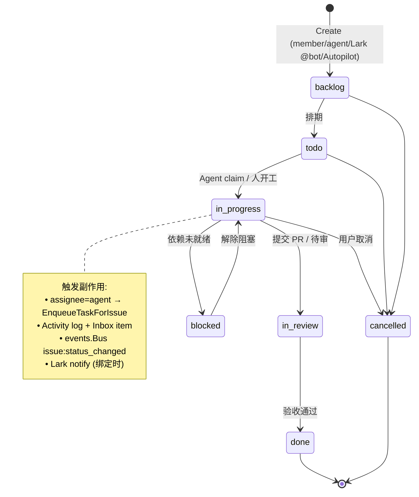
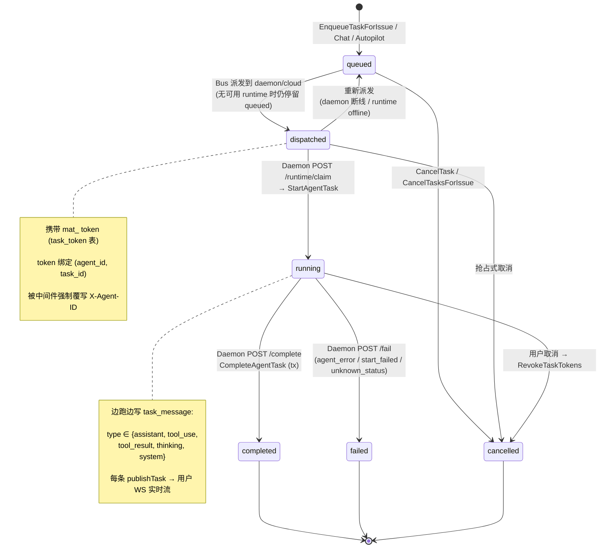
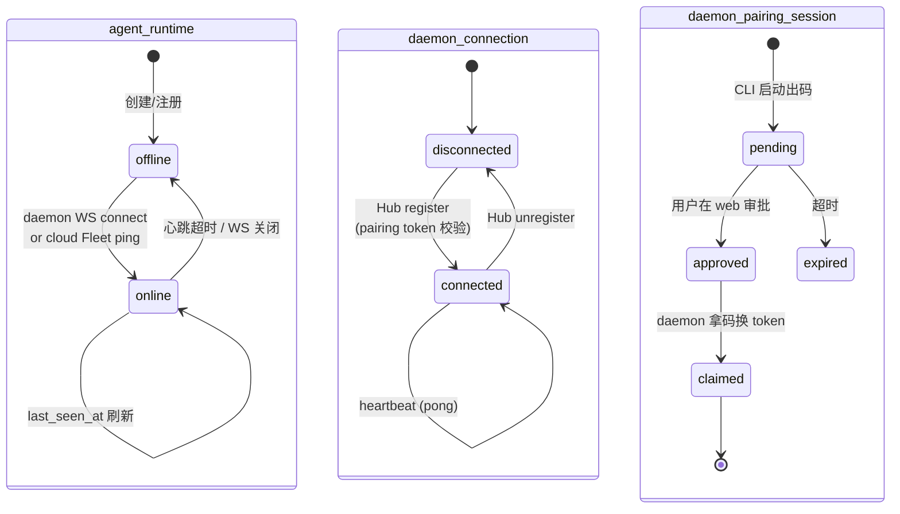
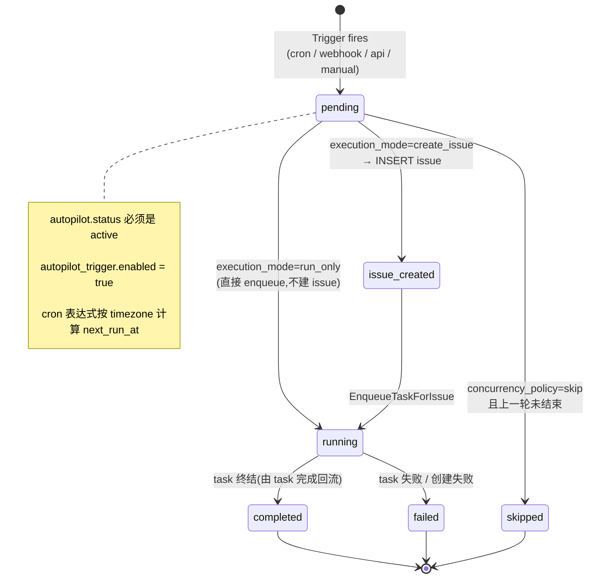
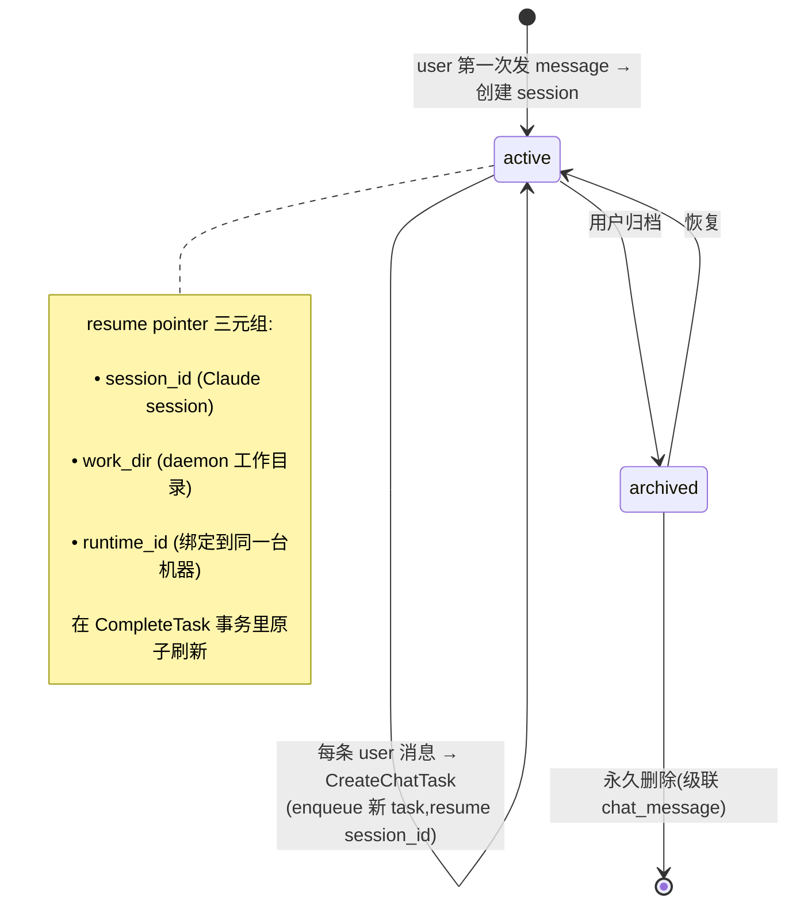
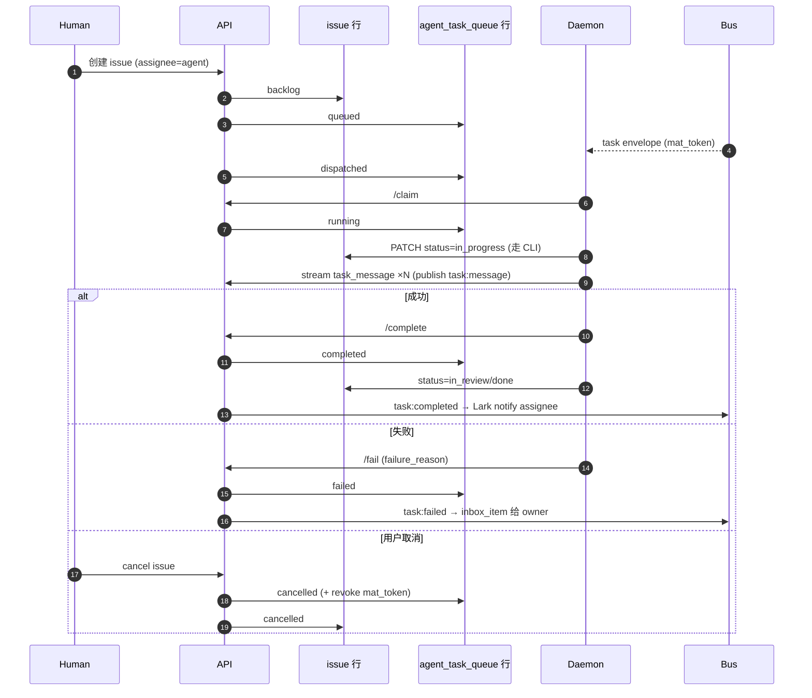

# Multica 关键对象的生命周期

整个系统里"有状态的活物"主要五种:**Issue / Agent Task / Agent Runtime / Autopilot Run / Chat Session**。下面逐一展开,所有状态枚举都来自数据库 CHECK 约束(`server/migrations/*.up.sql`),转移点来自 `server/internal/service/task.go`、`internal/handler/`。

---

## 1) Issue 生命周期

人 + Agent 协作的核心实体。状态机由人/Agent 都可推进,**Agent 通过 CLI 主动改 issue 状态**(服务端不在 task 流转时自动改 issue.status,见 `TaskService.StartTask` 注释:"Issue status is NOT changed here")。

**关键不变量**:
- `assignee_type ∈ {member, agent, squad}`;赋给 agent 时 `TaskService.EnqueueTaskForIssue` 自动产出一个 `agent_task_queue` 行。
- 取消 issue 时会级联调用 `CancelTasksForIssue` — 把所有"未完成的 task"扫成 `cancelled`,并撤销其 `mat_` task token(`captureTaskCancelled` 内部 `RevokeTaskTokens`)。
- `parent_issue_id` 支持子 issue;子全部 `done` 时,migration `043_issue_child_done.up.sql` 之后有 trigger / handler 推动父 issue。

---

## 2) Agent Task 生命周期(系统中最复杂的状态机)

这是整个调度系统的心脏。状态: `queued → dispatched → running → completed | failed | cancelled`。

**为什么这么设计 — 关键工程细节**:
- **`queued` vs `dispatched` 的区分**: `dispatched` 意味着已经把 envelope 推给某个 runtime,但 runtime 还没回 claim。daemon 断线/runtime 下线后,有 reconciler 把这些 `dispatched` 行回拨为 `queued`(`daemon_test.go:1713` 注释提到"任何忘记枚举的状态都必须走 FailTask")。
- **幂等收尾**: `CompleteTask` 用 `UPDATE … WHERE status='running'`;并发场景下取消和完成赛跑,无行更新就回查当前状态,当 cancelled/failed 也按成功返回(`task.go:1017-1027`)。
- **chat task 的事务**: 完成时 `CompleteAgentTask` 和 `UpdateChatSessionSession`(写 resume pointer `session_id` + `work_dir` + `runtime_id`)必须同一事务,否则下一条 chat 消息会基于旧 session_id 被 claim。
- **取消时必须撤销 token**: 否则被取消的 Agent 进程仍然能用 `mat_` 继续写 `task_message` / `comment`(`captureTaskCancelled` → `RevokeTaskTokens`)。
- **指标**: dispatch→complete 的毫秒数被采集到 analytics (`task.go:340-346`),Hub 转发的 `task:running` 事件专门为修复"UI 30s staleTime 卡顿"加的。

---

## 3) Agent Runtime / Daemon 连接生命周期

`agent_runtime` 是逻辑容器(local 或 cloud);`daemon_connection` 是实际 WS 会话。这两个表分开是因为一个 runtime 在 daemon 重启/迁机的时候会保持身份不变,只是连接换了。

**联动**:
- daemon WS 断开 → `daemonws.Hub` 取消注册 → `runtime.last_seen_at` 不再刷新 → 心跳调度器(`HeartbeatScheduler`)把 runtime 翻成 `offline` → reconciler 把该 runtime 名下的 `dispatched` task 回拨为 `queued` 等待重投。
- pairing 流程(`daemon_pairing_session`)是 CLI 首次接入时的一次性握手,产出长期 `daemon_token`(缓存在 `auth.DaemonTokenCache`)。

---

## 4) Autopilot Run 生命周期

定时/Webhook/API 触发的自动化"养 Agent 干活"。一个 `autopilot` 配一个 assignee agent + 多个 trigger,每次触发产出一个 `autopilot_run`,run 内部通常会创建一个 `issue` 并 enqueue 一个 task。

**并发策略**(`autopilot.concurrency_policy`):
- `skip`: 上一轮未结束 → 当前直接 `skipped`(默认)。
- `queue`: 排队,本轮等上一轮完成后再起。
- `replace`: 取消上一轮,起新的(走 `CancelTask` 路径)。

`autopilot_run.task_id` 反向链接到 `agent_task_queue`,让 dashboard 能从一个 run 跳到具体 task 输出。

---

## 5) Chat Session 生命周期

Chat 与 Issue 是平行入口:都会落到同一个 `agent_task_queue`,但 chat 不需要 issue。

**Runtime 绑定**: chat_session 完成第一个 task 后,`runtime_id` 被钉死 — 后续 chat message 必须落到同一 runtime,因为 work_dir 是本机路径,跨 runtime resume 没有意义。这是 `chat_session_runtime_id` 这条迁移 (060) 解决的问题。

---

## 6) 横切:一个 Issue 的完整生命视图(把所有线串起来)

---

## 小结:状态机的几个共性设计

1. **多入口同队列**: Issue 派发 / Mention / Squad leader / Chat / Autopilot 五个入口最终都走 `agent_task_queue`,共用同一状态机和 task_message 流。
2. **幂等终态**: completed / cancelled / failed 三个终态彼此可被赛跑写入,所有 `UPDATE … WHERE status=<src>` 失败时回查现状决定是否当成功。
3. **Token 与生命周期绑定**: `mat_` token 的存活窗口严格等于 task 的 `running` 窗口,取消即撤销;这是阻断"Agent 进程残留访问"的唯一防线。
4. **Issue 与 Task 状态解耦**: 服务端不替 Agent 改 issue.status — Agent 通过自身 CLI 改;这避免了"任务完成 ≠ 业务完成"的语义混淆,Agent 可以"完成了但发现还要再 review"。
5. **Runtime offline ≠ Task 失败**: 心跳超时只让 task 从 `dispatched` 退回 `queued`,等下次有 runtime 上线再派发,绝不直接 fail。这是"AI 同事下班/换设备"在产品上必须自然处理的语义。