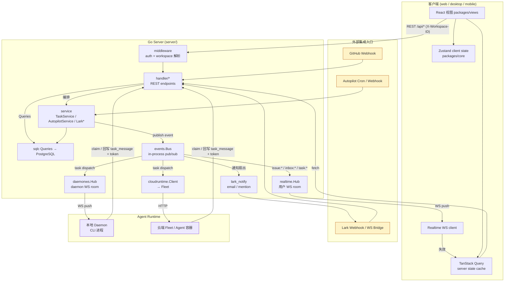
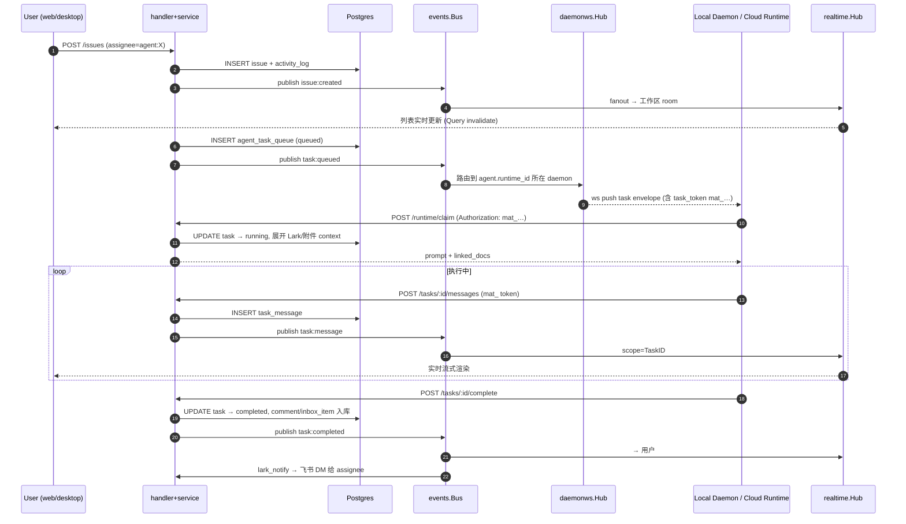
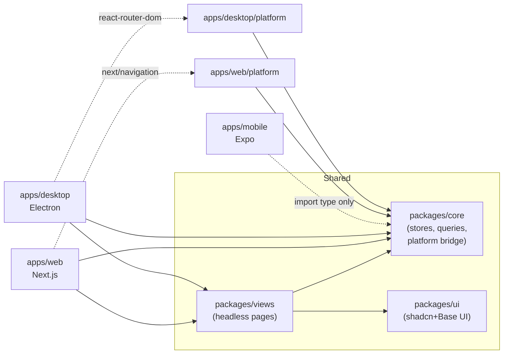

I have enough context. Let me compose the architecture analysis.

# Multica 架构分析

## 一、整体技术栈定位

Multica 是 **AI-native 的任务管理平台**(类似 Linear,但把 AI Agent 当作一等公民)。技术栈分为三层:

- **Go 后端**: Chi router + sqlc(PostgreSQL/pgvector)+ gorilla/websocket。`server/` 内包括 `handler` (HTTP)、`service` (业务编排)、`realtime` (WS Hub)、`daemonws` (本地 daemon 长连)、`events` (内部事件总线)、`cloudruntime` (云端 Agent 调度代理)。
- **前端 monorepo** (pnpm catalog + Turborepo): `packages/core` (纯逻辑/Zustand stores)、`packages/ui` (Base UI 组件)、`packages/views` (跨平台业务页面),由 `apps/web` (Next.js)、`apps/desktop` (Electron)、`apps/mobile` (Expo,只共享类型) 三端消费。
- **Runtime 子系统**: Local Daemon (CLI) 通过 WS 连入 `daemonws.Hub`;Cloud Runtime 走 `cloudruntime` HTTP 代理到 Fleet。

---

## 二、关键数据模型(110+ 迁移收敛后的核心实体)

```mermaid
erDiagram
    USER ||--o{ MEMBER : "joins"
    WORKSPACE ||--o{ MEMBER : "has"
    WORKSPACE ||--o{ AGENT : "owns"
    WORKSPACE ||--o{ AGENT_RUNTIME : "hosts"
    WORKSPACE ||--o{ ISSUE : "contains"
    WORKSPACE ||--o{ PROJECT : "groups"
    WORKSPACE ||--o{ SKILL : "library"
    WORKSPACE ||--o{ SQUAD : "teams"
    WORKSPACE ||--o{ AUTOPILOT : "automations"
    WORKSPACE ||--o| LARK_WORKSPACE_BINDING : "lark chat"
    WORKSPACE ||--o{ GITHUB_INSTALLATION : "github app"

    AGENT_RUNTIME ||--o{ AGENT : "runs"
    AGENT }o--o{ SKILL : "agent_skill"
    SKILL ||--o{ SKILL_FILE : "files"

    AGENT ||--o{ AGENT_TASK_QUEUE : "tasks"
    AGENT_RUNTIME ||--o{ AGENT_TASK_QUEUE : "executes"
    ISSUE ||--o{ AGENT_TASK_QUEUE : "spawns"
    CHAT_SESSION ||--o{ AGENT_TASK_QUEUE : "drives"
    AUTOPILOT_RUN ||--o{ AGENT_TASK_QUEUE : "creates"
    AGENT_TASK_QUEUE ||--o{ TASK_MESSAGE : "stream"
    AGENT_TASK_QUEUE ||--o{ TASK_TOKEN : "mat_ token"

    PROJECT ||--o{ ISSUE : "scope"
    ISSUE ||--o{ ISSUE : "parent/sub"
    ISSUE ||--o{ COMMENT : "discussion"
    ISSUE ||--o{ ISSUE_DEPENDENCY : "blocks/related"
    ISSUE }o--o{ ISSUE_LABEL : "issue_to_label"
    ISSUE ||--o{ ISSUE_SUBSCRIBER : "watchers"
    ISSUE ||--o{ ATTACHMENT : "files"
    ISSUE }o--o{ GITHUB_PULL_REQUEST : "issue_pull_request"
    ISSUE ||--o{ INBOX_ITEM : "notify"
    ISSUE ||--o{ ACTIVITY_LOG : "audit"

    SQUAD ||--o{ SQUAD_MEMBER : "members"
    AGENT ||--|| SQUAD : "leader"

    AUTOPILOT ||--o{ AUTOPILOT_TRIGGER : "cron/webhook"
    AUTOPILOT ||--o{ AUTOPILOT_RUN : "executions"
    AUTOPILOT_RUN ||--o| ISSUE : "creates"

    CHAT_SESSION ||--o{ CHAT_MESSAGE : "messages"
    AGENT ||--o{ CHAT_SESSION : "with user"

    USER ||--o| LARK_USER_LINK : "open_id"
    ISSUE ||--o{ LARK_MESSAGE_REF : "thread refs"

    AGENT_RUNTIME ||--o{ DAEMON_CONNECTION : "local ws"
    USER ||--o{ PERSONAL_ACCESS_TOKEN : "pat"
    USER ||--o{ NOTIFICATION_PREFERENCE : "settings"
```

**模型要点**:
- **多租户**: 一切都挂在 `workspace_id` 下,sqlc 查询全部带工作区过滤(`X-Workspace-ID` 头解析)。
- **多态 Actor**: `assignee_type / creator_type / author_type / actor_type ∈ {member, agent, squad, system}` + 对应 `id`,这是"AI 作为一等公民"的核心建模。
- **Agent 与 Runtime 解耦**: `agent` 是逻辑身份(workspace 内的"AI 同事"),`agent_runtime` 是执行容器(local daemon 或 cloud fleet),通过 `agent.runtime_id` 关联;`agent_task_queue` 双指针(`agent_id` + `runtime_id`)使得切换 runtime 不丢任务。
- **任务三种来源**: Issue 派发、Chat 会话、Autopilot 触发 → 都进同一个 `agent_task_queue`,消息流统一落 `task_message`。
- **任务级凭证**: `task_token`(`mat_` 前缀)绑定 `(agent_id, task_id)`,Agent 进程拿这个 token 回调时被中间件强制覆写 `X-Agent-ID`,防伪造。
- **集成边界表**: Lark (`lark_workspace_binding`/`lark_user_link`/`lark_message_ref`) 和 GitHub (`github_installation`/`github_pull_request`/`issue_pull_request`) 都是独立桥接表,不污染 issue 主表。

---

## 三、整体交互逻辑(请求 → 派发 → 实时回放)

**关键流程语义**:
1. **写路径**: 前端调用 REST → `middleware` 验证(JWT/PAT/`mat_` token)并把 `(member, workspace)` 注入 ctx → `handler` 用 `loadIssueForUser/loadAgentForUser` 解析多态 ID,只用解析后的 `entity.ID` 做 DB 写 → `service` 编排事务 → `events.Bus.Publish`。
2. **派发路径**: `Bus` 的订阅者把 `task:dispatch` 路由到 `daemonws.Hub`(本地 daemon)或 `cloudruntime.Client`(Fleet),取决于 `agent_runtime.runtime_mode`。
3. **Agent 回流**: Runtime 用 `mat_` token 回调 `/runtime/claim` 拿任务上下文(含 Lark 文档展开/附件),用同一 token 流式写 `task_message`,服务端边写边 `publishTask` → 用户 WS 看到实时输出。
4. **读路径(去重读模型)**: 前端**永远**通过 TanStack Query 读服务端状态;WS 事件只触发 query invalidation,不直接写 Zustand,这就是 CLAUDE.md 强调的"WS events invalidate, never write stores"。
5. **集成回灌**: Lark/GitHub webhook 也走 `handler` → `service`,Lark `@bot 创建任务` 通过 `LarkThreadService` 把消息体转成 issue + 关联 `lark_message_ref`;通知反向通过 `lark_notify` 把 `task:completed` 之类事件推回飞书 DM(当前分支 `feat/lark-integration` 的工作)。

---

## 四、Agent 任务生命周期(把上面汇总成时序)

---

## 五、前端 share 边界(配套架构,简表)

**核心不变量**: `core` 无 DOM、无 `process.env`;`views` 无 `next/*` / `react-router-dom`(导航统一走 `NavigationAdapter`);`mobile` 只通过 `import type` 共享类型,拒绝运行时耦合以保独立 React/Expo 版本节奏。

---

## 总结

- **数据中枢**: `workspace` 横向分租户 + 多态 actor (`member|agent|squad`),让 Agent、人类、机器人队伍能在同一组业务表中互操作。
- **执行中枢**: `agent_task_queue` 是唯一队列,issue 派发 / chat / autopilot 三种来源都收敛进来,`agent_runtime` 抽象 local vs cloud。
- **通信中枢**: `events.Bus` 是单一事件源 → `realtime.Hub`(用户)、`daemonws.Hub`(daemon)、`cloudruntime`(Fleet)、`lark_notify`(外部 IM) 四路扇出。
- **安全边界**: `mat_` task token 绑定 `(agent_id, task_id)`,中间件强制覆写,杜绝 Agent 进程伪造其他身份。